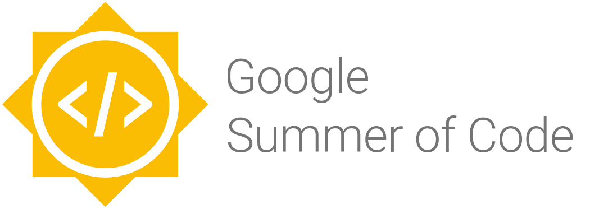

<!-- $theme: default -->

Software libre como salida profesional
=========================================

**I Jornadas de la Familia Profesional de Informática**

*I.E.S. El Rincón 17 Marzo de 2017*

Oliver Gutiérrez Suárez

---

Acerca de...
============

---

Inicios
-------
En un primer momento toda la materia y energía de este universo se concentraba en un punto que explotó y dio origen al universo conocido en lo que ahora llamamos el Big Bang.

*Creo que esto ya lo sabíamos y si no, ya han aprendido algo nuevo*

---

Estudiante en el I.E.S. Pérez Galdós (1994-1998)
------------------------------------------------
* Primer ordenador mío y sólo mío (1996)
  * Intel 80286 1Mb RAM y 40Mb HD
* Primer contacto con la programación (1996)
  * QBasic de MSDOS 6.22
* Primer ordenador decente (1997)
  * Pentium 200MMX
* Primer contacto con el software libre (1997)
  * Linux Slackware 3.4
  * Red Hat Linux 5.1

---

Estudiante de sistemas en la ULPGC 2 años (1998-1999)
-----------------------------------------------------
* Matrícula de honor en "Cafetería, billar y juegos de cartas"
* Becario en el departamento de informática de Ciencias Básicas
* Primer contacto con el GULIC en una fiesta de instalación en el I.E.S. El Rincón. 
* Organizador de las primeras LAN parties en Gran Canaria
  * Administración de servicios SAMBA, DNS, FTP, Compartir internet con modems usando NAT...

---

Estudiante en El Rincón 3 años (2000-2002)
------------------------------------------
* Dependiente en dos cybercafés
* Programador de Visual Basic 6
* Técnico de sistemas en el Complejo Hospitalario Materno-Insular

---

Estudiante de gestión en la ULPGC por segunda vez (2002-2003)
-------------------------------------------------------------
* Aprobado el primer año
* Abandonado el segundo año para cursar la segunda edición del Programa de Creación de Empresas de la FULP
* Premio a la iniciativa empresarial más innovadora

---

Últimos años hasta hoy (2004-2017)
----------------------
* EVO Sistemas Libres (2006-2010)
* Consultor freelance (2011)
* Desarrollador web y administración de sistemas (2012-2015)
* Desarrollador del equipo de escritorio en Red Hat (2015 hasta hoy)

---

Mi trabajo en Red Hat
=====================

---

Herramienta para administradores de sistemas para la gestión de perfiles de usuario

* Configuración de aplicaciones de escritorio
  * Basadas en gsettings
  * LibreOffice
  * Gnome Online Accounts
  * NetworkManager
* Integración con FreeIPA

Disponible ya en Fedora 24 y Fedora 25

GitHub: https://github.com/fleet-commander/

---

Software libre como salida profesional
======================================

---

* Beca de colaboración en proyectos de software libre
* Mentores de los proyectos seleccionados
* Procedimiento: Elegir una organización, seleccionar un proyecto y escribir una propuesta.

Más información: https://developers.google.com/open-source/gsoc/

---

* Becas de colaboración en proyectos de software libre
* Fundación GNOME
* Para grupos con poca representación en el software libre
  * Mujeres
  * Colectivo LGTB
  * Etnias minoritarias en U.S.A.
* Límite: 30 de Marzo de 2017

Más información: https://www.gnome.org/outreachy/

---

GRACIAS
=========

Contacto
--------
ogutierrez (at) redhat (dot) com
matrixhas.me
