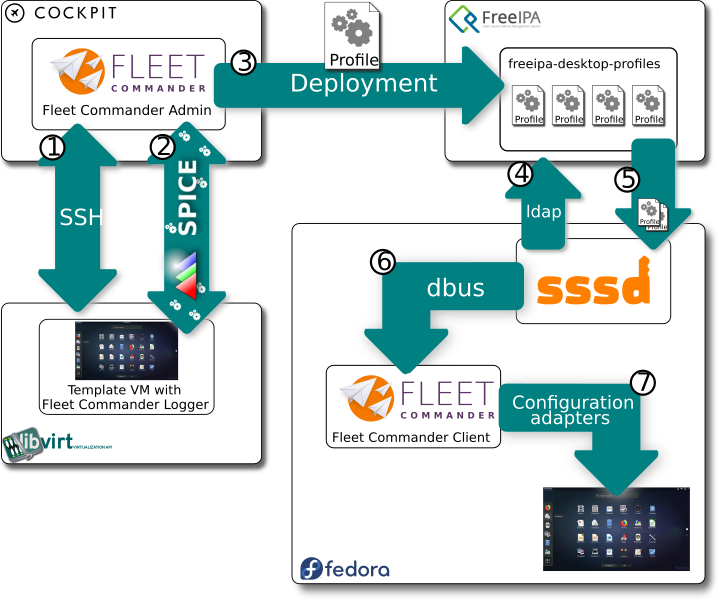
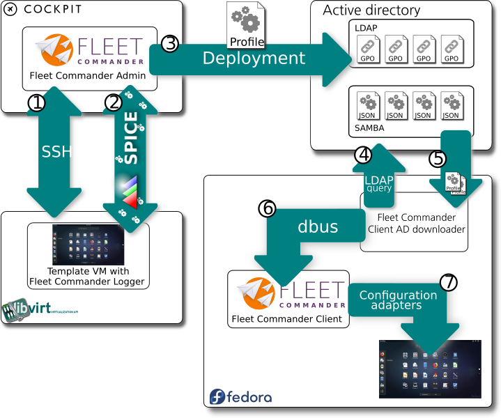

<!-- $theme: default -->
<!-- $size: 16:9 -->
<!-- page_number: true -->

Development status June 2019
Oliver Gutiérrez · ogutierrez@redhat.com

---

# What is Fleet Commander?

A complete solution for management and deployment of user desktop profiles over large network environments

---

# Ok... And what is a desktop profile?

A desktop profiles is a group of desktop environment and application related settings that can be associated to a network user, group, host or group of hosts.

---

# Why not use ansible or something like that?

* Ansible and other tools are configuration management tools and they are designed to deploy systemwide configuration.

* User profiles are not machine settings. They are userspace and desktop settings.

* Also every user could have different profiles in the same machine, and needs to change dinamically on every login.

---

# Fleet Commander components

* **Fleet Commander ADMIN**
    * Cockpit plugin as interface for managing the desktop profiles
    * dbus service that does the heavy lifting 
* **Fleet Commander LOGGER**
    * Application that logs setting changes during a live session (more on this later)
* **Fleet Commander CLIENT**
    * Application that read profiles that applied to current user and deploys the configuration to user desktop environment

---

# How does Fleet Commander work? (I)

## System administrator side
1. System administrator prepares profiles using Fleet Commander Admin
	* Define the profile settings to be applied
	* Define the users, groups, hosts or host groups the settings will be applied to
2. Profiles are saved in the organization identity or directory server

---

# How does Fleet Commander work? (II)

## User side
1. User logs into organization laptop/workstation
2. Computer connects to organization server and asks for desktop profiles to download
3. Fleet commander client uses downloaded profiles to configure the desktop environment and applications the system administrator defined

---

# FreeIPA big picture

---

# Active Directory big picture

---

# Active directory development status (I)

## Fleet Commander Admin

* We are able to store profiles on GPOs
* We are able to save profile settings on Samba CIFs
* We are able to set permissions based on the selected users, groups, hosts

---

# Active directory development status (II)

## Fleet Commander Client

* Developed the Active Directory settings downloader
	* We are able to download the settings that applies only to the user logging in
* Modified configuration adapters
    * Privilege separation to avoid security issues of having all the code executed in privileged environment
* Currently testing the whole bunch of components and their integration