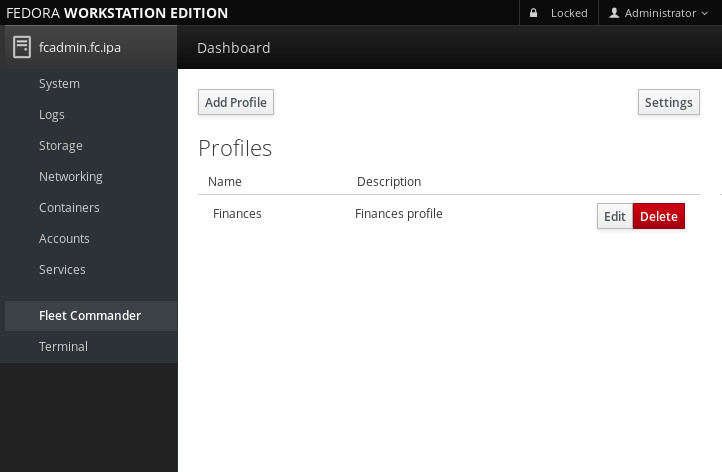
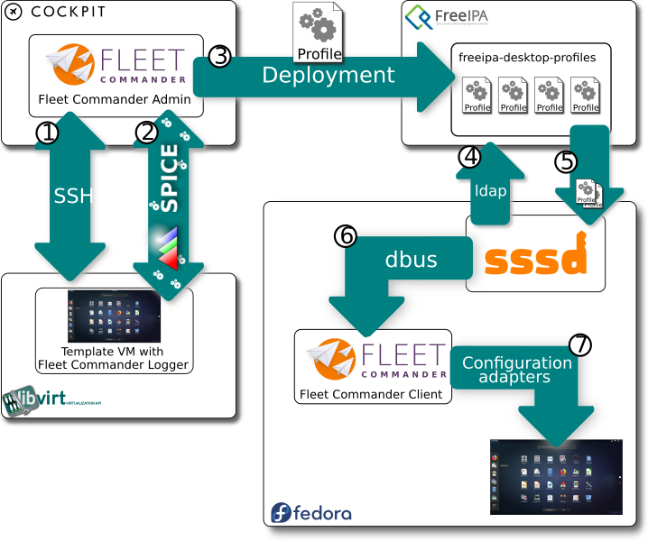
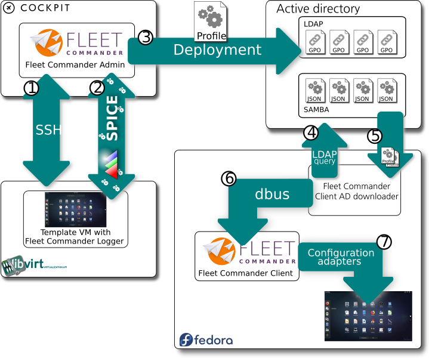

<!-- $theme: default -->
<!-- $size: 16:9 -->
<!-- page_number: true -->

Oliver Gutiérrez - ogutierrez@redhat.com
PyDay Gran Canaria 2019

---

# ¿Qué puedo esperar de esta charla?

---

# Yo he venido aquí a hablar de mi libro.

Fleet Commander es el proyecto en el que trabajo a tiempo completo

---

# Y para explicarlo contaré...

* Algo de administración de sistemas
* Algo de cómo trabajamos con la comunidad de software libre
* Algo de Python
* Un poco de las tecnologías que se usan para hacer que Fleet Commander funcione

---

# ¿Qué es Fleet Commander?

Solución completa en Linux para la administración y despliegue de perfiles de escritorio en redes corporativas.

---

# Vale... ¿Podrías repetírlo?

Solución completa en Linux para la administración y despliegue de perfiles de escritorio en redes corporativas.

---

# Venga, va... ¿Y qué es un perfil de escritorio?

Son grupos de ajustes del entorno y aplicaciones de escritorio que pueden asociarse a un usuario, un grupo de usuarios, un equipo y/o un grupo de equipos

---

# ¿Y por qué hace falta algo como esto?

Porque gestionar este tipo de perfiles es un infierno para los administradores de sistemas.

---

# Guay. Pero...

## ¿Por qué no usas algo que ya está hecho como Ansible, que además es Python y mola mazo?

---

# Pueeeeeeeeeeeeesssss....... (larga inspiración)

---

* Porque Ansible y otras herramientas, son herramientas de gestión de la configuración y están diseñadas para desplegar configuración a nivel del sistema.

* Los perfiles de escritorio no son ajustes de la máquina. Son ajustes del espacio de usuario y del escritorio.

* Además, cada usuario puede tener un perfil distinto en la misma máquina y las necesidades pueden cambiar de forma dinámica en cada inicio de sesión.

---

# Ya, pero...

## ¿Por qué no haces simplemente un script que copie la configuración y la escriba en el $HOME del usuario?

---

# EL $HOME NO SE TOCA

---

* No es fácil seguir los cambios de configuración para cada aplicación
* Cada aplicación lee y esscribe lo que le da la gana donde le da la gana

---

# Planteamiento de Fleet Commander

1. Crear una herramienta que permita gestionar los perfiles de escritorio de forma fácil
2. Hacer que generar los perfiles sea algo intuitivo y no estar editando ficheros de texto con las configuraciones
3. Usar estándares para soportar el mayor número posible de aplicaciones
4. Que sea muy fácil añadir aplicaciones no soportadas

---

# Componentes de Fleet Commander

* **Fleet Commander ADMIN**
* **Fleet Commander LOGGER**
* **Fleet Commander CLIENT**

---

# Fleet Commander ADMIN

Interfaz para el administrador de sistemas en el que se administran los perfiles de escritorio y a qué usuarios, grupos y máquinas de la red, se les deben aplicar.

---

# Tecnologías usadas en Fleet Commander ADMIN

* Python (POR SUPUESTO)
* Cockpit (HTML5, Websockets, dbus)
* Spice
* SSH
* libvirt
* FreeIPA
* Active Directory
* Samba
* LDAP

---

# Fleet Commander LOGGER

Aplicación que permite monitorizar los cambios que se hacen en una máquina virtual para luego poder grabarlos en un perfil de escritorio.

---

## Tecnologías usadas en Fleet Commander LOGGER

* Python (POR SUPUESTO)
* dbus
* GNOME (gsettings)
* NetworkManager
* LibreOffice
* Firefox
* Chrome

---

# Fleet Commander CLIENT

Es la aplicación que se encarga de descargar y aplicar los perfiles al usuario en cuanto inicia sesión en el sistema.

---

## Tecnologías usadas en Fleet Commander CLIENT

* Python (POR SUPUESTO)
* dbus
* GNOME (gsettings)
* NetworkManager
* LibreOffice
* Firefox
* Chrome

---

# ¿Cómo funciona Fleet Commander? (I)

## En el lado del administrador de sistemas
1. El administrador diseña y prepara perfiles usando Fleet Commander Admin
	* Define que ajustes se deben aplicar (usando máquina virtual con Fleet Commander Logger)
	* Define a que usuarios, grupos o máquinas se aplica este perfil
2. Los perfiles se graban en el servidor de directorio de la empresa

---

# ¿Cómo funciona Fleet Commander? (II)

## En el lado del usuario
1. El usuario inicia sesión en su máquina
2. Fleet Commander Client se conecta al servidor de directorio y descarga los perfiles de escritorio que aplican en ese caso concreto
3. Fleet commander Client compila todos los ajustes y los despliega en las localizaciones necesarias para que el escritorio y las aplicaciones queden configuradas.

---

# Demo

---

# ¿Y qué ocurre por debajo?

Depende del sistema de directorio que estemos usando, pero en general es todo lo mismo

---

# Visión global usando FreeIPA

---

# Visión global usando Active Directory

---

# Soporte de otros sistemas de configuración

* Contactar con la comunidad de ese proyecto
* Establecer una forma de leer (FC LOGGER) y aplicar (FC CLIENT) la configuración.
* Desarrollar un módulo en el logger que lea la configuración y permita añadirla a los perfiles en el FC ADMIN
* Desarrollar un módulo de despliegue que obtenga la información guardada en un perfil y aplicarla generando los datos necesarios
* Añadir el nuevo módulo al FC ADMIN para que reconozca la información que le llega del FC LOGGER y pueda guardarla en los perfiles.

---

# ¿PREGUNTAS?

---

# GRACIAS

### Fleet Commander

* Web: https://fleet-commander.org/
* GitHub: https://github.com/fleet-commander
* IRC: #fleet-commander - irc://irc.freenode.net/fleet-commander
* Video presentación en FOSDEM 2018: https://www.youtube.com/watch?v=N2nYF-ApI6I

